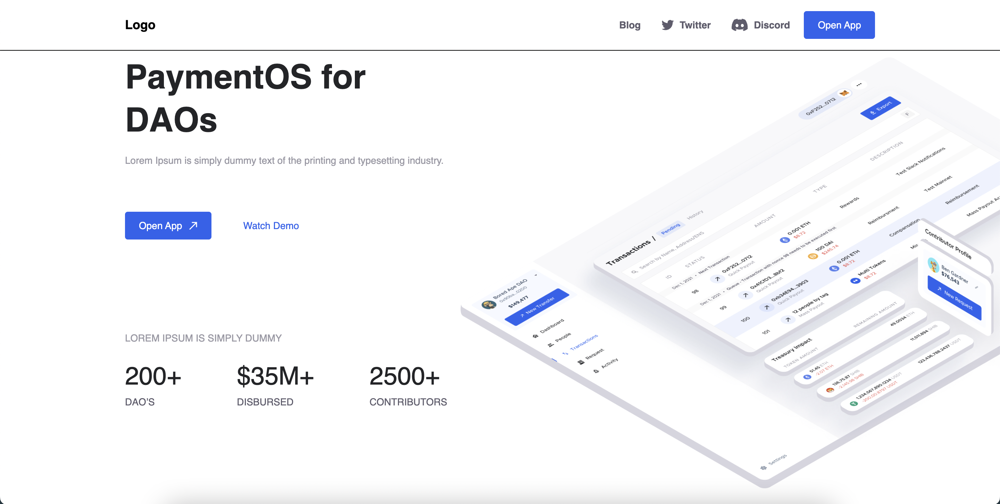
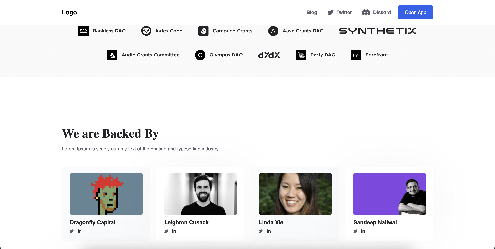
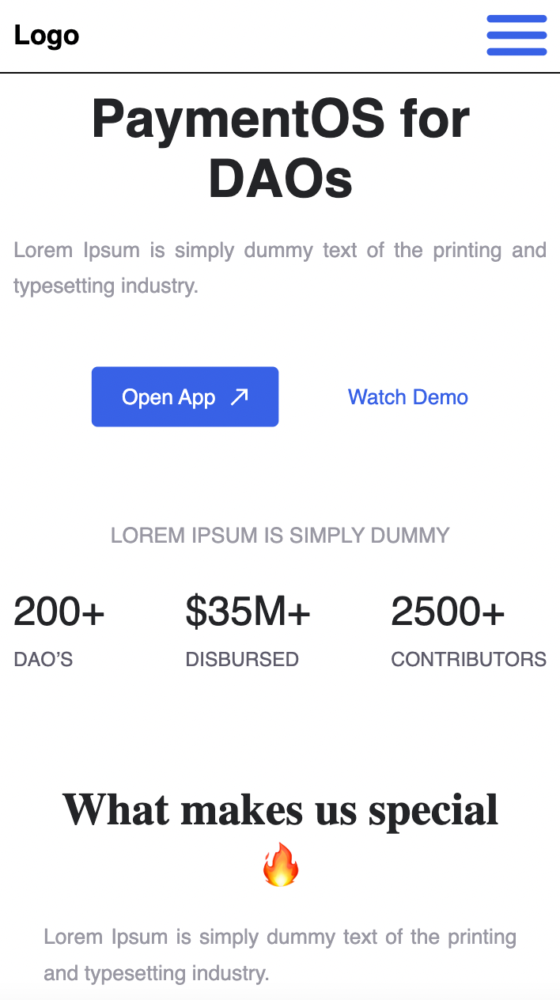
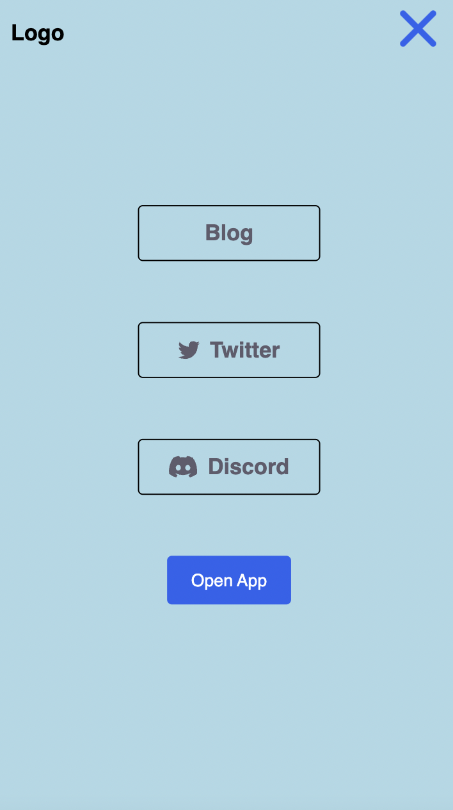
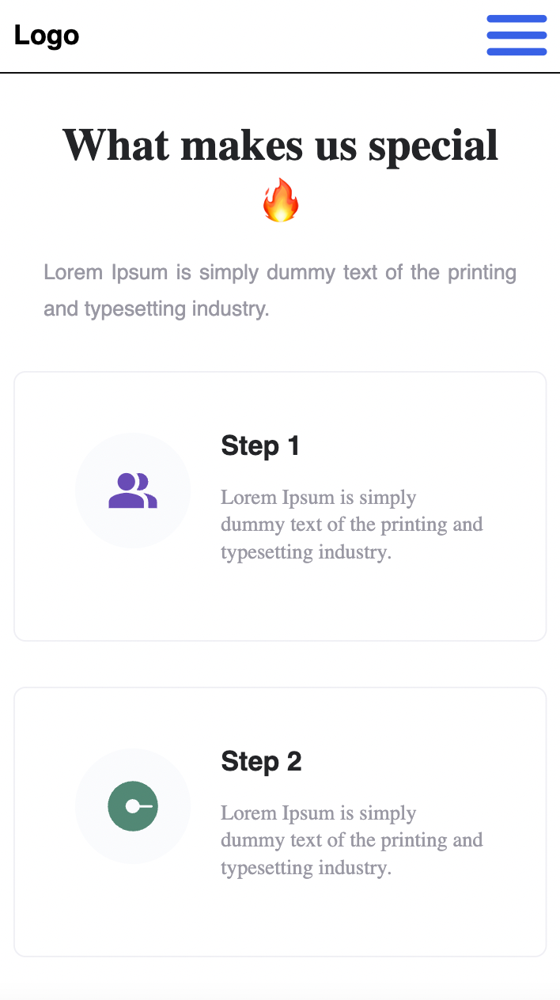
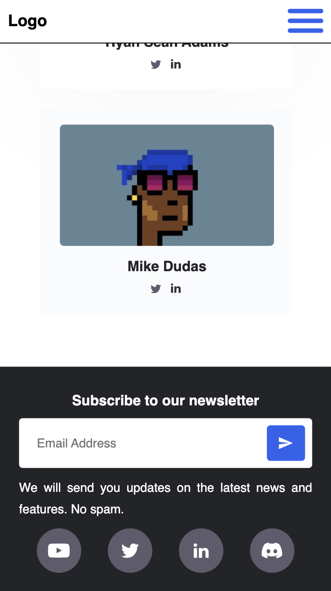

# Payment Landing Page

Adaptive Landing Page (BEM + Scss + Webpack)

## Getting Started

1. Clone this project to your computer: `git clone https://github.com/vadikot/payment-landing-page`
2. Compiled project with minified files in 'dist' folder.
3. Open 'index.html' file in your browser.

## Application screenshots (Desktop)

## Application screenshots (Mobile 320px)

